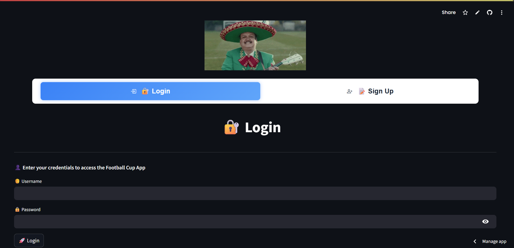
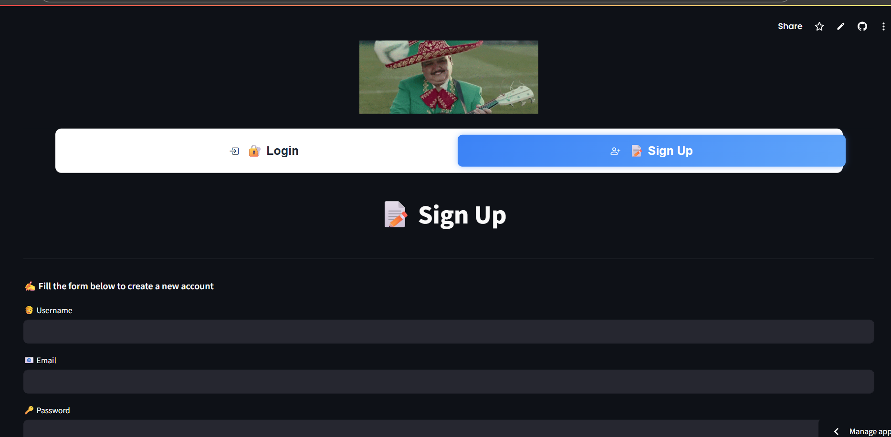
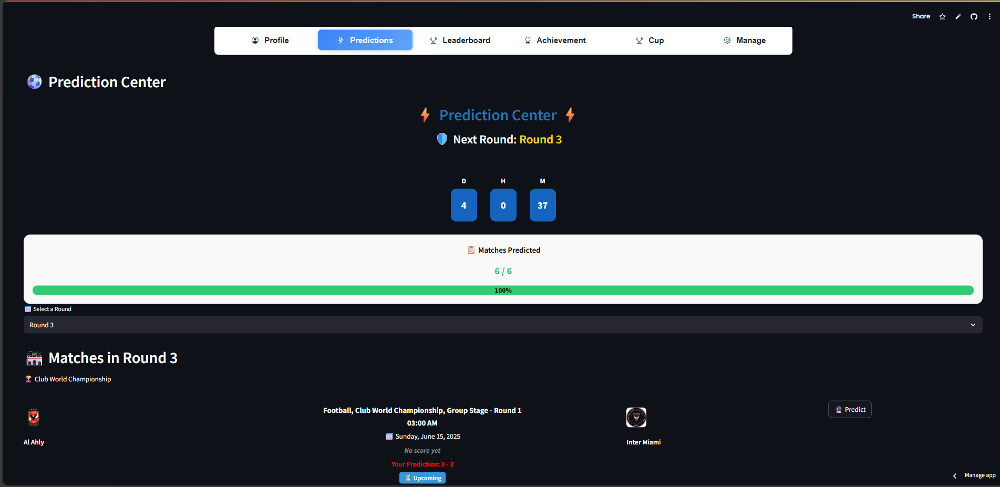
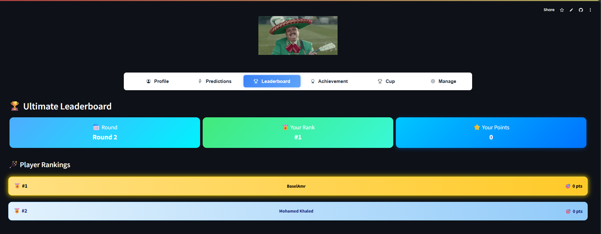
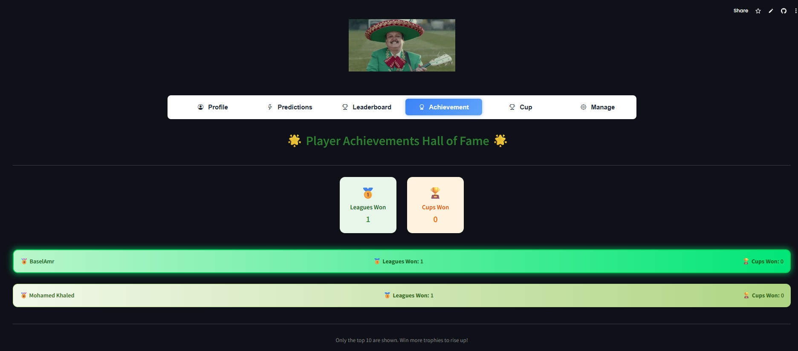
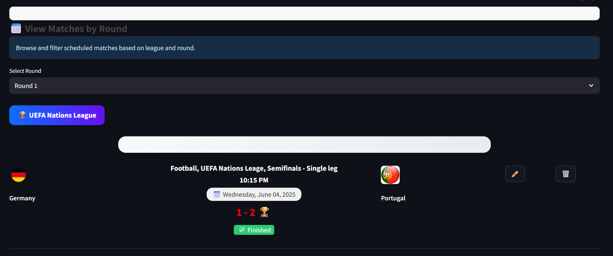
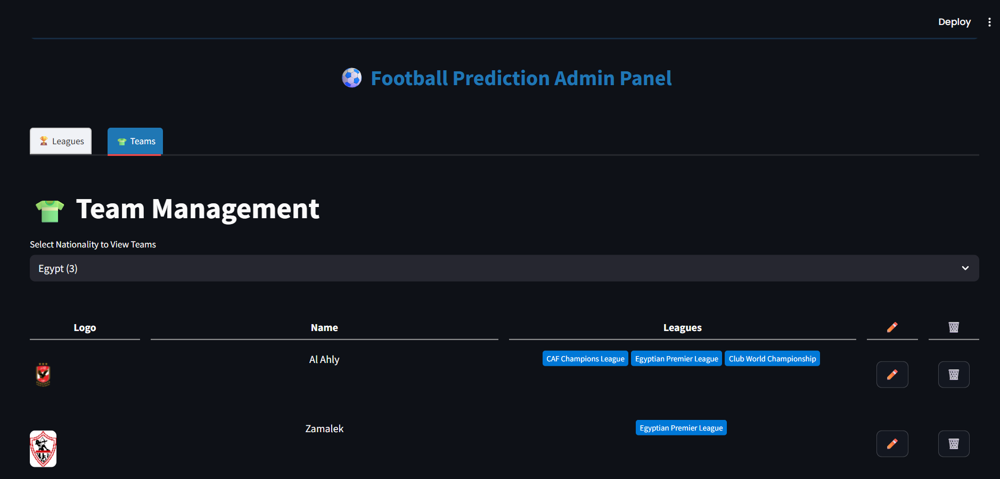
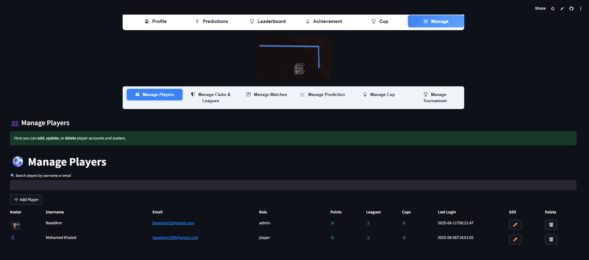
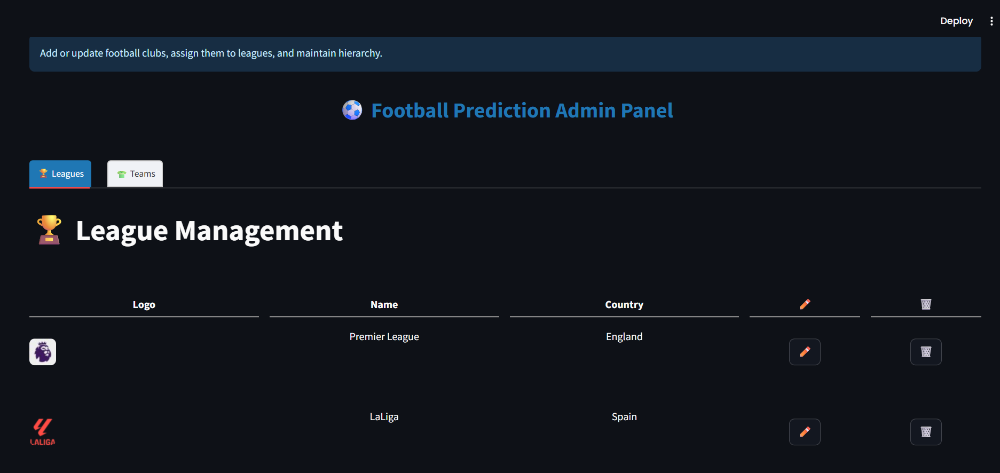

# ⚽ Match Predictor - Premier League Edition

[](https://matchpredictor.streamlit.app/)
[](LICENSE)

Welcome to **Match Predictor**, a full-featured Premier League match prediction platform. Predict upcoming matches, track your performance, manage players and teams, and climb the leaderboard in style!

🌐 **Live App**: [matchpredictor.streamlit.app](https://matchpredictor.streamlit.app/)

---

## 🎯 Features

- 🔐 **Login & Signup** – Secure authentication for all users.
- 🧠 **Smart Predictions** – Submit or update match predictions before each round’s deadline.
- 📅 **Admin Panel** – Full control to manage players, matches, teams, and leagues.
- 🥇 **Leaderboard & Achievements** – Track top predictors and unlock achievements.
- ✉️ **Personalized Email Reminders** – Sent 2 days, 1 day, and 2 hours before kickoff.
- 📊 **Profile Page** – Review your history, performance, and prediction accuracy.
- ⚙️ **Dynamic Match Management** – Admins can add or edit fixtures in real time.
- 🚀 **Deployed on Streamlit Community Cloud** – Fully online and free to use.

---

## 🖼️ Gallery

| Login | Signup | Profile |
|-------|--------|---------|
|  |  |  |

| Prediction | Leaderboard | Achievements |
|------------|-------------|--------------|
|  |  |  |

| Add Match | Manage Matches | Manage Teams |
|-----------|----------------|---------------|
|  |  |  |

| Manage Players | Manage Leagues |
|----------------|----------------|
|  |  |

---

## 📦 Tech Stack

- **Frontend/UI**: [Streamlit](https://streamlit.io/)
- **Backend**: Python (controllers, logic & scheduling)
- **Database**: SQLite
- **Email Integration**: SMTP (Gmail)
- **Deployment**: Streamlit Community Cloud

---

## 🚀 Live Demo

Try the app live now:  
👉 [https://matchpredictor.streamlit.app/](https://matchpredictor.streamlit.app/)

---

## 🧪 Getting Started (Local)

1. **Clone the repository**:
   ```bash
   git clone https://github.com/your-username/match-predictor.git
   cd match-predictor
